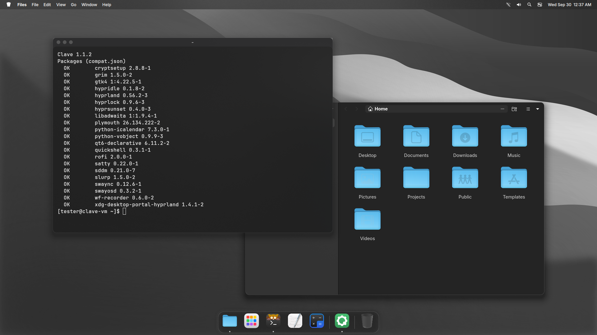
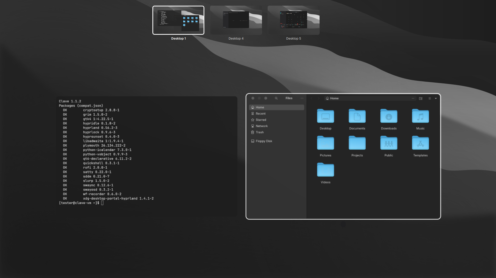
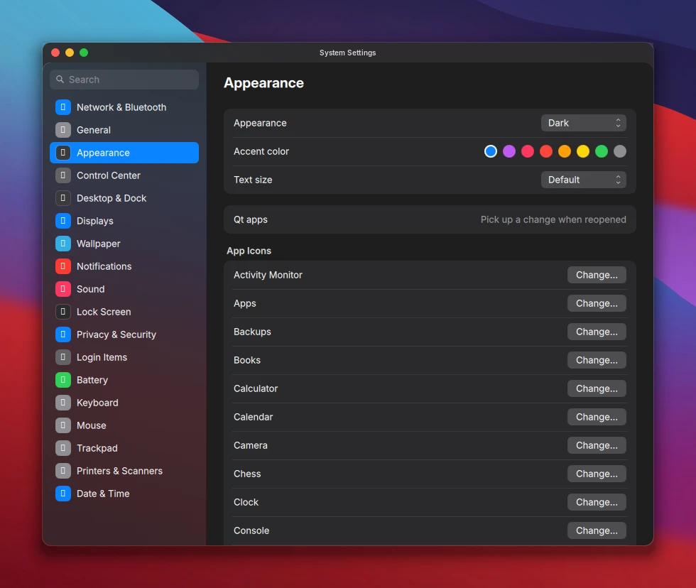
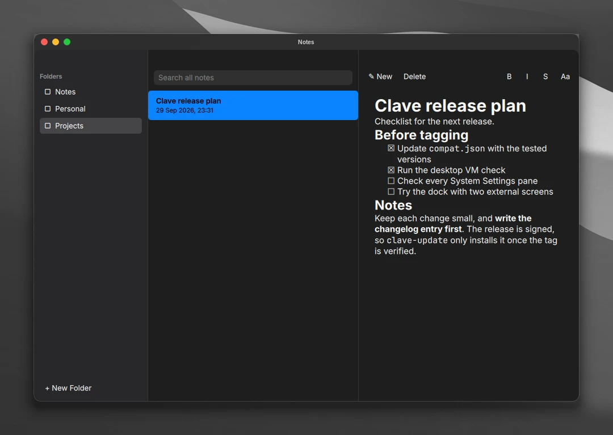
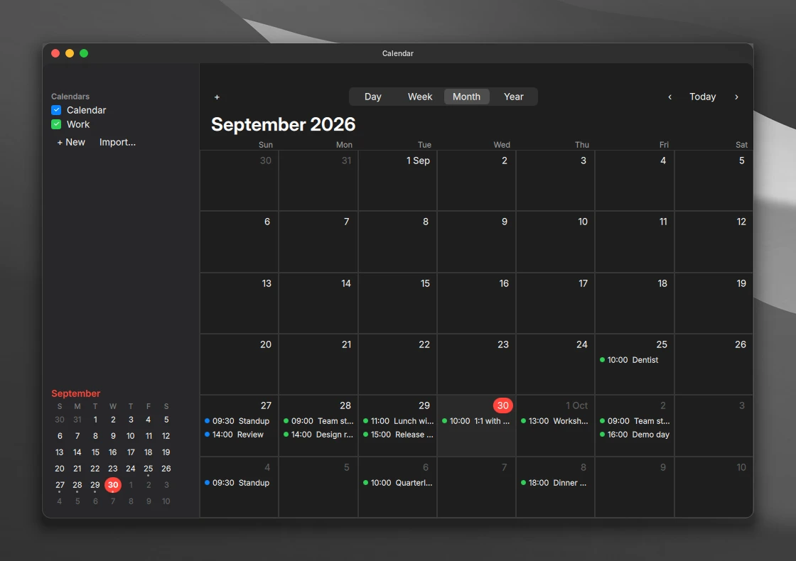

<p align="center">
  <picture>
    <source media="(prefers-color-scheme: dark)" srcset="docs/assets/brand/wordmark-dark.png">
    
  </picture>
</p>

<h3 align="center">Hyprland, finished.</h3>

<p align="center">A complete desktop for Arch Linux. Tiling kept.</p>

<p align="center">
  <a href="https://github.com/Andrew-most-likely/clave/releases/latest"></a>
  <a href="https://github.com/Andrew-most-likely/clave/actions/workflows/ci.yml"></a>
  
  <a href="LICENSE"></a>
</p>

<p align="center">
  <a href="https://andrew-most-likely.github.io/clave/"><b>Website</b></a> &nbsp;&middot;&nbsp;
  <a href="#install">Install</a> &nbsp;&middot;&nbsp;
  <a href="#a-look-around">Screenshots</a> &nbsp;&middot;&nbsp;
  <a href="#reference">Reference</a>
</p>

<p align="center">
  
</p>

## In short

- **A whole desktop.** Menu bar, Dock, Overview, Control Center and System Settings.
- **Hardened by default.** Firewall, AppArmor and a hardened kernel from the start.
- **Quiet.** Works offline. A feature you turn off runs nothing.

## Install

On Arch Linux, as your normal user:

```sh
bash <(curl -fsSL https://raw.githubusercontent.com/Andrew-most-likely/clave/main/setup.sh)
```

Then log out and choose **Hyprland** on the login screen. The installer asks before it changes anything.

<details>
<summary><b>Install by hand, and installer options</b></summary>

You can also install by hand:

```sh
git clone https://github.com/Andrew-most-likely/clave ~/.local/src/clave
cd ~/.local/src/clave
./install.sh --dry-run   # preview
./install.sh
```

Then log out, and pick Hyprland on the login screen.

| Option | What it does |
|---|---|
| `--yes` | No questions. The hardening layer is included; its warning is printed. |
| `--no-harden` | Skip the security hardening layer |
| `--extras` | Also install the optional apps in `packages/extras*.txt`, including the GNOME utilities Disks, Disk Usage Analyzer, Snapshot and Passwords and Keys |
| `--personal` | Use fonts, a cursor and sounds you supply. See Personal option under Reference. |
| `--user-only` | Only install files in `$HOME`. No sudo, no login screen or boot splash. |
| `--no-packages` | Skip pacman, AUR and Flatpak |
| `--dry-run` | Show what would happen and change nothing |

</details>

<details>
<summary><b>Coming from another setup</b></summary>

**Coming from ML4W or another setup?** The installer moves `~/.config/hypr` and `~/.config/quickshell` to
`<dir>.bak-<date>`. It turns config directories that were links into `~/.mydotfiles` into real copies, so it never
writes into another project's files. It keeps your `monitors.lua`, wallpapers, current wallpaper and pinned Dock
apps. `./uninstall.sh` puts everything back.

**Updating from arch-macos-hyprland?** Clave is the new name of this project. The installer moves an existing
install to the new names and keeps your settings, Dock, wallpaper and your own files. Old command names in
`custom.lua` are updated, and a copy of the file is kept in `~/.local/state/clave/backups`.

</details>

## A look around

<table>
  <tr>
    <td width="50%"></td>
    <td width="50%"></td>
  </tr>
  <tr>
    <td><b>Overview.</b> Every window and Space at once.</td>
    <td><b>System Settings.</b> One pane for each part, with search.</td>
  </tr>
  <tr>
    <td></td>
    <td></td>
  </tr>
  <tr>
    <td><b>Notes.</b> Plain Markdown files. Yours to keep.</td>
    <td><b>Calendar.</b> Plain <code>.ics</code> files. No account.</td>
  </tr>
</table>

More screenshots and a video tour are on the [website](https://andrew-most-likely.github.io/clave/).

## Keyboard basics

| Keys | Does |
|---|---|
| `Super+Space` | Search |
| `Super+Tab` | Overview |
| `Super+Return` | Terminal |
| `Super+,` | System Settings |
| `Print` | Screenshot |
| `Super+/` | Show every shortcut |

<details>
<summary><b>All keyboard shortcuts</b></summary>

Press `Super+/` to see all of them.

| Keys | Action | Keys | Action |
|---|---|---|---|
| `Super+Space` or tap `Super` | Search | `Super+W` / `Super+Q` | Close window / Quit app |
| `Super+A` | Apps | `Super+M` / `Super+H` | Minimize to the Dock / Hide app |
| `Super+Tab` | Overview | `Super+F` / `Super+Ctrl+M` | Full screen / Zoom |
| `Alt+Tab` | Switch windows | `Super+T` | Float or tile the window |
| `Super+Return` | Terminal (kitty) | `Super+1…0` | Go to a Space |
| `Super+E` | Files | `Super+Shift+1…0` | Move the window to a Space |
| `Super+B` | Web browser | `Super+Arrows` | Move focus |
| `Super+,` | System Settings | `Super+Alt+Arrows` | Swap windows |
| `Super+N` | Notification Center | `Super+Shift+Arrows` | Resize the window |
| `Super+Ctrl+N` | Control Center | `Super+S` | Scratchpad |
| `Super+V` | Clipboard history | `Super+/` | All keyboard shortcuts |
| `Ctrl+Super+Space` | Emoji & Symbols | `Print` | Screenshot and recording toolbar |
| `Super+L` | Lock screen | `Shift+Print` | Copy text from the screen (OCR) |
| `Super+Alt+Esc` | Force Quit | `Super+Alt+G` | Game mode (turns effects off) |

</details>

## Reference

Open only what you need.

<details>
<summary><b>Everything Clave includes</b></summary>

**Desktop**
- Menu bar with the System menu, the app menu, battery, Wi-Fi, sound and the clock. There is one menu bar per screen.
- Control Center (Wi-Fi, Bluetooth, Focus, brightness, volume, Night Light, media) and Notification Center
- Dock with magnification, running indicators, pinning, and the genie minimize animation. The animation uses
  GLSL shaders and a small Hyprland plugin, `hypr-minimize`.
- Traffic-light title bars from `hyprbars`, built from source for your Hyprland version
- Overview, hot corners, Search (apps, and a calculator one `Ctrl+Tab` away that works offline), Apps,
  Activity Monitor (CPU, memory, disk and network, with Quit and Force Quit) and Force Quit
- System Settings (`Super+,`) with panes for Network & Bluetooth, Displays, Sound, Battery, Appearance (light or
  dark, text size), Desktop & Dock, Wallpaper, Control Center, Notifications, Lock Screen, Login Items,
  Printers & Scanners, Date & Time, Trackpad, Mouse, Keyboard, and Privacy & Security
- Screenshots and screen recording: `Print` opens a toolbar (screen, a window you click, an area, recording, a
  timer and where to save), and `Shift+Print` copies the text in an area.
  Images go to `~/Pictures/Screenshots` and the clipboard; click the thumbnail in the corner to mark one up.
- Displays: resolution, scale, rotation and arrangement per screen, remembered by the screen itself, and
  mirroring from Control Center
- Clave apps, drawn in the shell's style: Notes (Markdown files in `~/Documents/Notes`), Calendar (`.ics`
  files) and Contacts (`.vcf` files). No accounts and no sync: the files are yours.
- Clipboard history (`Super+V`), emoji picker (`Ctrl+Super+Space`), Night Light, and a keyboard shortcut list
  (`Super+/`)
- A lock screen and idle timeouts, an SDDM login screen, and a Plymouth boot splash

**Trackpad:** swipe left or right with 3 fingers to switch Spaces. Swipe up for Overview. Pinch with 4
fingers for Apps, and spread 4 fingers for full screen.

**Theme:** WhiteSur GTK, icons, Kvantum and Firefox themes, the Bibata cursor, Inter and JetBrains Mono, and the
freedesktop sound theme. Qt5, Qt6,
GTK4/libadwaita and Flatpak apps all follow the theme.

**Standard apps** (`packages/apps.txt`, all from the Arch repositories): Reminders, Stickies, Weather, Clock,
Maps, Photos, Books, Podcasts, Music, Videos, Voice Memos, Camera, Fonts, Chess, Freeform board, Scanner,
Screen Sharing, Console, System Information, Disk Utility, Keychain and Backups, next to Files, Text Editor,
Calculator and the image and archive viewers. None of them runs a background service. Only Weather, Maps and
Podcasts go online, and only while open. Change any app's icon in System Settings > Appearance.

**Desktop essentials:** GNOME Keyring, printing (CUPS and mDNS discovery), Bluetooth, exFAT and NTFS support,
CJK and emoji fonts, zram, a journald size cap, and weekly cache cleanup.

**Disk Encryption:** Clave says when the disk is not encrypted and guides the setup, either a reinstall with
LUKS2 or encrypting this install in place. See [docs/ENCRYPTION.md](docs/ENCRYPTION.md).

</details>

<details>
<summary><b>What the hardening changes</b></summary>

**Hardening** (on by default; `--no-harden` skips it. If it locks you out, see [docs/RECOVERY.md](docs/RECOVERY.md).)
- The `linux-hardened` kernel with lockdown, IOMMU and init_on_free flags
- sysctl lockdown, AppArmor (`apparmor.d`) and auditd
- An nftables firewall that drops all inbound traffic by default, with OpenSnitch for outbound traffic
- USBGuard, faillock, a stricter sudo configuration, `umask 027` at login, and a `noexec` `/tmp`
- An AIDE baseline and daily `arch-audit` CVE checks

</details>

<details>
<summary><b>Customize</b></summary>

The installer never replaces files you own:

| File | For |
|---|---|
| `~/.config/hypr/custom.lua` | Any Hyprland setting, shortcut or autostart. It loads last, so it wins. |
| `~/.config/hypr/monitors.lua` | Screens. System Settings > Displays can write this file. |
| `~/.config/hypr/hypridle.conf` | Idle timeouts. System Settings > Lock Screen edits this file. |
| `~/.config/kitty/custom.conf` | Terminal settings |
| `~/.config/clave/` | Everything System Settings saves, including Dock pins and the current wallpaper |
| `~/.config/clave/branding/logo.svg` | Your own logo for the menu bar, the About window and the boot splash |

System Settings > Lock Screen sets the login screen background and your profile picture. Desktop & Dock
turns on Space numbers in the menu bar and lists apps that should not get title bar buttons, for apps that
draw their own. Keyboard switches the Super key symbol in menus between ⌘ and ❖, and can turn on editing shortcuts on the
Super key (Super+C, X, V, Z; clipboard history then moves to Super+Shift+V).

See [`docs/examples/`](docs/examples/) for a 2-in-1 laptop setup. Put wallpapers in `~/Pictures/Wallpapers`.

</details>

<details>
<summary><b>Update</b></summary>

Open System Settings > General > Software Update, or run `clave-update`. The command updates the system packages
and Flatpaks, then pulls the newest release of this desktop and reinstalls only the files that changed. Hyprland
plugins are rebuilt automatically after every Hyprland upgrade by a pacman hook. If a plugin still fails to load at
login, it is rebuilt then.

Arch updates the software Clave depends on at any time. `clave-doctor` checks that this Clave still works with what
is installed: the Hyprland config, the plugins, the shell's log, the GTK4 theme, and each package Clave talks to
against the versions this release was tested with (`compat.json`): OK, Untested, or Update Clave. It uses no network;
`clave-doctor --fetch` also reads the list of known problems from the newest signed release. `clave-update` runs it at
the end, and a pacman hook warns after an upgrade and shows one notification at the next login when a newer Clave
is needed.

</details>

<details>
<summary><b>Uninstall</b></summary>

```sh
~/.local/src/clave/uninstall.sh            # files in $HOME
~/.local/src/clave/uninstall.sh --system   # also the login screen, boot splash, hardening
```

Every file that the installer replaced comes back from the copy it kept in `~/.local/state/clave/backups`. The config directories that were moved
aside come back too. Packages stay installed.

</details>

<details>
<summary><b>Personal option</b></summary>

`./install.sh --personal` lets you use assets that you supply yourself. It changes assets only, never wording, and
updates keep it.

- **Fonts and cursor:** installs the fonts and cursor listed in `packages/personal-aur.txt` from the AUR and uses
  them everywhere instead of Inter, JetBrains Mono and Bibata.
- **Sounds:** put your own sound files in `~/.local/share/sounds/clave/source/` and run `clave-sounds-build`. The
  names it looks for are listed in that script. Without them, the freedesktop sounds play.
- **Logo:** put an SVG at `~/.config/clave/branding/logo.svg`. This works without `--personal` too. Run
  `install.sh` again to put it on the boot splash.

To go back to the public build, delete `~/.local/state/clave/personal` and run `./install.sh` again.

</details>

<details>
<summary><b>Not included, on purpose</b></summary>

- **Third-party themes.** The WhiteSur icons and Kvantum theme come from the AUR. **Wallpapers and the
  GTK/Firefox theme** are downloaded from the WhiteSur repositories at install time.
- **Fonts, cursors, logos or sounds that the project has no right to ship.** Use the personal option below.
- **Hardened `/etc/fstab` options** must be merged by hand. See `scripts/extra/fstab-hardening.txt`.

</details>

<details>
<summary><b>Things to know</b></summary>

- **Hardening risks:** USBGuard blocks USB devices that were not plugged in during the install. Three wrong passwords
  lock the account for 15 minutes. Keep a recovery USB. [docs/RECOVERY.md](docs/RECOVERY.md) explains how to get
  back in.
- **SDDM reads every file in `/etc/sddm.conf.d`, backups included.** The installer moves `*.bak*` files to
  `/etc/sddm.conf.d.backup`.
- **The calculator works offline.** The installer turns off the weekly download of currency rates, so currency
  conversion in Calculator has no rates. To turn it back on: `gsettings reset org.gnome.calculator refresh-interval`.
- **VS Code asks to use weaker encryption?** Check `~/.vscode/argv.json`. If it has `"password-store": "basic"`,
  change it to `"password-store": "gnome-libsecret"` and restart VS Code. You need to sign in again once.
- **Logs:** the installer writes `~/.cache/clave/install.log`, and the plugin build writes
  `~/.cache/clave/rebuild-plugins.log`. Attach them to bug reports.

</details>

<details>
<summary><b>Development</b></summary>

```
install.sh / uninstall.sh / setup.sh
compat.json             versions each release was tested with, and known breaks
home/                   files installed into $HOME (__HOME__ is filled in)
system/<group>/         root files, grouped look | desktop | harden
packages/<group>*.txt   pacman, -aur and -flatpak lists per group
lib/                    installer functions, the move from the old name, --personal
scripts/                root half of the installer, theme download, capture, checks
scripts/extra/          kernel flags, Firefox prefs, fstab hardening notes
tests/                  install, migrate, app and compatibility tests (CI runs them)
docs/                   guides, changelog, project plan, website and brand assets
.github/ci/             upstream watch: watched packages and the daily check
```

The upstream watch and `compat.json` are described in [docs/UPSTREAM.md](docs/UPSTREAM.md).

See [CONTRIBUTING.md](.github/CONTRIBUTING.md). The goals, requirements and roadmap are in
[docs/PROJECT_PLAN.md](docs/PROJECT_PLAN.md).

</details>

## Credits and license

Parts of this project started from [ML4W dotfiles](https://github.com/mylinuxforwork/dotfiles) by mylinuxforwork,
so this project is under the same license, [GPL-3.0](LICENSE). The WhiteSur themes are by
[vinceliuice](https://github.com/vinceliuice). `hyprbars` comes from
[hyprwm/hyprland-plugins](https://github.com/hyprwm/hyprland-plugins) (BSD-3-Clause) and is downloaded at build
time.

Apple, macOS and San Francisco are trademarks of Apple Inc. This project is not affiliated with or endorsed by
Apple.
